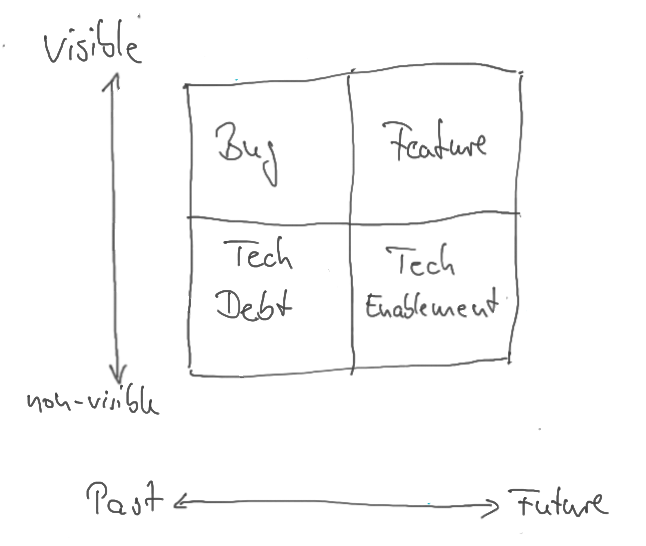
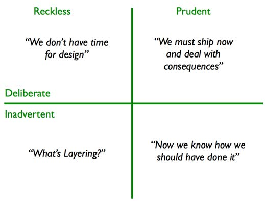
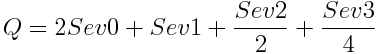
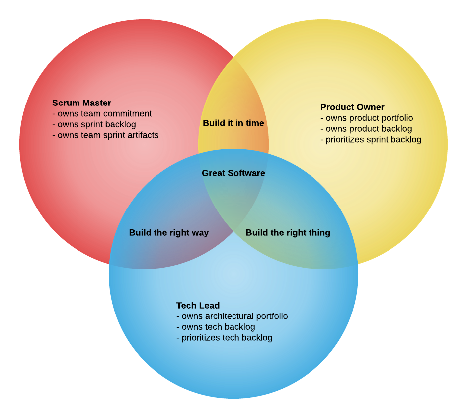

# Building an Architectural Portfolio

A common set of metaphors to use when describing technical tradeoffs is to borrow from the world of finance. We've all heard and used terms like “Tech Debt” and “Tech Enablement”, but often the definitions are not clear to everyone involved. This paper will seek to clarify how the VAT is thinking about the long term health of our technology base that enables us to serve our customers. 

## Terminology

We can categorize the items in the backlog in two dimensions:

* visible / non-visible
* negative impact in the past / positive impact in the future

The visibility means if they can be noticed by the main stakeholders. For the customer visible items should be managed by the product manager/owner. Whereby non-visible topics should be managed by architects/tech leads.

The second dimension categorizes the backlog items in issues with negative impact in the past (bugs, investigations, missing limits, 3rd library upgrades, ...) and issues with positive impact in the future (e.g. architectural investments → Falcon, centralized feature toggles, ... ). We can also say these are reactive or proactive work items. 

### feature

A feature is a **functional** **behavior** that is defined by our Product Management team and advertised purposefully to our customers. It is the contract of what the customers are purchasing - the promise of a behavior that they find desirable to help them achieve their business goals. 

In financial terms, features can be visualized as the technical assets we (engineering) want to invest in because the assets help solve real world problems for our customers - our customers feel happier and more satisfied when we build great features for them.

### Bug / Investigation

A bug is an **undesirable** **behavior** occurring in the software either because:

* the implementor misunderstood or mis-implemented the requirements that were specified
* the requirements did not account for this situation and the implementor either made an undesirable decision, or more commonly failed to accommodate for the situation

Bugs are customer-visible and should be driven by the product organization. 

In our financial analogy, bugs are assets that we purchased hoping to make customers happy, and the customer feedback is either that we purchased the wrong asset, or we purchased a shoddy asset (junk bond?) that doesn't quite live up to its promise. Its where we have buyers remorse because we need to invest more dollars in enhancing the feature to let it make our customers happy.

### Tech Debt

Tech debt is **non-functional** in nature and typically not directly visible in the functionality to the users. It is the cost of past compromises and mistakes and often makes it harder or slower for engineers to build more features to please the customers.  Once enough debt has accumulated even small changes carry the risk of introducing new and undesirable behaviors (bugs).  Typically Tech Debt accrues either because of shortcuts taken to meet dates, or because we didn't really understand all of the non-functional aspects of features that we built in the past.

Tech debt needs to be carefully tracked and advocated for elimination by the Tech Lead of a team - no one else is well positioned to understand both the current drag and also the future costs.

In our financial analogy, this is high interest (like credit card) debt. It builds and produces increased drag the longer we let it mount. Paying off only the minimum balance is a poor strategy and eventually causes us to need to take more drastic action. However if managed carefully it can enable us to produce customer value rapidly when we need to. 

### Tech Enablement

Tech enablement can be either **functional or non-functional** in nature. It is the transformational opportunities enabled by **proactively** investing in technologies. With many instances of poorly implemented technology causing loss of ROI and potential product failure, tech enablement allows new technology to improve business and engineering processes, achieve greater scale, speed, and consistency, and enhance the ability to manage risk and compliance.

Tech Enablement should flow from long term technical and product visions established jointly by team Tech Leads, Architects, and Product Owners. 

In our financial analogy, this is your long term investment strategy - investing your dollars in particular stocks and bonds in order to try to make more money in the long run. Enablement needs to be done with full understanding of all of the other assets, investments, and liabilities being made across the portfolio - the debt, the other investments being made, and our future purchase wishlist in order to ensure that investments are wise for our future.

## Financial Advisory Process

### Take Financial Inventory

Like any financial advisor will tell you, start by taking an inventory. Every team Tech Lead should start with an **inventory of assets and liabilities** facing the team. Take care to understand the dimensions of each asset and liability - what is the rate of interest vs the payoff balance of the liability? What is the value of the asset and how much upkeep does it require? We don't want to rush ahead to make plans without knowing our sum totals because it might lead to prioritizing the wrong things. 

In our analogy that might be akin to committing to pay off a random credit card bill based on the day it came in, without regard for the balance or interest rate - which can lead to paying more interest than we might have had we applied a technique like [debt stacking or debt snowballing](https://www.thebalance.com/debt-snowball-vs-debt-stacking-453633) to determine which one to pay off. 

### Quantify

In finance we track debts and assets in terms of dollar values. In software we can apply numerics in order to perform a similar value based analysis. A common method is to take a simple formula based on 'Severity' of a liability or asset. The Tech Lead and the team must carefully consider a risk-based assessment of each item in their backlog. What is the risk of not eliminating this debt? What is the risk of not performing this investment? What is the risk of introducing this new piece of debt? If a team can consistently use the same methodology for risk based decision making, then the liabilities can be consistently tracked over time. This is similar to how 'Velocity' works in scrum, only applied as a health metric for the team's area of responsibility. 

Total debt loads can be compared by using a simple geometric decay formula like: 

It is important to note that while TechDebt can be viewed in the absolute sense, it depends on a consistent definition being applied across teams in order for the absolute values to be compared. This can be useful to judge which areas of the product are in greater need of technical attention. However even without that consistency across teams, so long as within a team the definitions are applied consistently, the rate of change of TechDebt over time will indicate when debt is accumulating and when it is being removed - giving us trending information about the codebase and overall health of an area of the system.
Likewise the TechDebt load can be used to help the team make quantifiable decisions on future tasks. When considering different paths, the team might estimate the severity and number of stories required to course correct from a decision to build debt. By using quantification the team can better understand the cost of trading off different approaches in terms that can be shared with product ownership and management more easily.

### Take Accountability

Just like our creditors hold us individually accountable for the debt that we build, so too must engineering share with product and management our debt loads in a transparent fashion where all parties can see the effects of different decision making. Often engineering teams silently build tech debt because of assumptions pulled from date discussions without an explicit decision being made around accepting debt. Debt building and elimination must be as thoughtful and transparent a process as building new features. Engineering teams should maintain and publish and maintain their Tech Debt Load metrics in a clearly visible location and it should be a topic of discussion and presentation in Sprint Reviews and 3RR Planning. To do otherwise would be like a family member making lots of purchases on the shared family credit cards without discussion of their purchases - we want a more deliberate process.

A useful exercise for self-improvement is for the team to plot their tech debt on the following axis by source so that they can have insight into why their debt builds and can then take actions to control future debt more effectively.

A team should strive for tech debt to be mostly around Business Risk Acceptance. Unforeseen Problems happen, and we should do our due diligence to avoid them when possible. Reckless tech debt accumulation in the form of Ignoring Best Practices (usually due to schedule pressure) and making Amateur Mistakes (typically due to not doing your research) should be avoided. Being honest within your team and considering how you arrived at your tech debt can help guide future decision making and processes to get a better outcome.

### Visualize Goals

Once we have a complete picture of where we are today in a quantifiable way, but before we can build our portfolio, we must invest time in understanding what we want to achieve with our portfolio. This is done by understanding what our long term success looks like from both product vision and from architecture vision. This is akin to financial advisors understanding the financial goals of an individual — will they plan for a new house? Where do they want to retire? Do they like to travel? By understanding where we want to be in the future and roughly went, we can start to build an investment portfolio that gets us there. Why build something we won't make good use of for 2 years? Or we'd better build something now if there are going to be 5 use cases for it coming soon. The output of this phase is a technical vision that can be written, shared, and socialized. This is the picture of where we want to go from a technology perspective in order to support our product vision. 

### Develop Investment Thesis

Next we begin our research to understand what are the right investments to make in order to achieve these goals. This is essentially establishing our investment thesis - we don't want to be overly prescriptive yet, but we want to generally understand how we are approaching making our investments. We work in an agile business, and the volatile stock market makes a great metaphor - one stock may not pan out, or timing may change - we know we will have to make adjustments, so we focus on general strategies at this phase - something that is loose enough that we can adapt to change, but clear enough that everyone understands the goals.

### Assemble an Advisory Board

Instead of going at it alone, get yourself an advisory board - people whose opinions the Tech Lead trusts and might be different from the team's own opinions. By seeking more divergent opinions on problems, often better solutions emerge. This can help detect poorly thought out investment strategies, overly risky plans, and even sidestep silly mistakes - especially those made around assumptions that are common within the team, but unknown outside the context of the team echo chamber.

### Implement an Investment Plan

Next we move to creating a plan. This is where the Tech Lead has buy-in on the investment thesis from the architects and product organization, and sequences the investments into a roadmap so that we don't try to work on everything at once. This allows us to stay agile - we focus on single investments at a time in order to minimize the chance that the world shifts while we are working. The overall thesis guides us in making decisions and updating the plans as the situation on the ground changes. The output of this phase is a living high level plan that everyone can see. This is the plan that guides and influences the actual tech enablement backlog.

### Track Your budgets

By taking our highest priority investments into account, and by understanding our debts, we should be able to establish a budget that allows us to balance purchasing assets, improving faulty assets, paying down debt, and investing for the future. The Tech Lead should work with the product owner to ensure that our budget is always well balanced. Like any endeavor, we need the flexibility to overspend in some areas at different times, but by doing so thoughtfully with a budget, we should be able to make better decisions as a team that ensures both awesome assets for our customers, and long term technical health for ourselves. 

## Bringing it all together

### Iteration

Part of being agile is being iterative - the processes described herein are quite a bit of work to initially setup, but with a regular cadence of update it is easy for the Tech Lead to maintain the vision, the investment plan, and the backlog. Jointly these represent the investment portfolio for a team and should be shared broadly - the Tech Leads should be sharing this with their team, their management team, the product manager and even their peers. This level of transparency helps ensure that everyone is aware of the direction we are going and the paths we think we will take. These paths may change as the situation on the ground changes, but it gives everyone a common point of understanding and drives better decision making by everyone.

### Agile Architecture

We talk about the “3-in-a-box” model for leading our engineering teams. Agile - especially scrum - invests a great deal of effort into defining the jobs of the Scrum Master and the Product Owner. We even offer trainings and coaching specifically for those roles in our organization. Less well articulated is the expectations on the 3rd member of that team - the Tech Lead. All three parties must cooperate closely together to make the team successful for the long run. Any one party dominating that relationship will yield to eventual problems for the team. There should not be a planning session, a retrospective, or a sprint review that does not include all three of these leaders as each has an important flag to carry for the development of great software.

* The Scrum Master should always be team focused - one eye on the commitments and one eye on how to increase velocity by ensuring the long term health of what the team owns. Only the Scrum Master can commit the team to a course of action, and once committed, the Scrum Master owns the individual sprint backlog 
* The Product Owner must listen to the input from the Tech Lead and the Scrum Master to shape the product portfolio plans to ensure that the vision can be achieved in a reasonable business timeframe. Ultimately all prioritization belongs to the Product Owner, but the Scrum Master is not obligated to commit to that backlog if it is not in the team’s best interest
* The Tech Lead must proactively build the architectural portfolio and the log of tech debt in order to help articulate health and tradeoffs for the other leaders to be able to understand
* The Tech Lead must also work to understand what the Product Owner is planning for the future in order to inform the team Investment Thesis - the Tech Enablement Vision of future success 
* The Tech Lead should then also negotiate with the Product Owner and Scrum Master for inclusion of tech items into the sprint backlog

## Conclusion

By being deliberate and explicit in our tracking and decision making, engineering gains the ability to be more proactive about how it ensures that teams are empowered to both make good decisions, and can deliver great new software quickly. The process to get there is quite simple, but requires discipline by a large number of engineers, but the systems are in place already to support these actions - we only need the engineering teams to commit to taking the time to do it.

## Appendix

### Potential measures

* Pain = Probability(Incident_x) * Impact_x
    * Impact_x = downtime, dollar loss, GMV loss should the incident occur
    * Pain could be a means to guide assignment of priority to tickets (P0 - high pain ... P3 - no pain)
    * When taking on work a Story can help reduce pain.
* Tech Debt Ratio = (Remediation Cost SWAG / Development Cost of Proposal SWAG) 
    * (borrowed from https://medium.com/the-andela-way/what-technical-debt-is-and-how-its-measured-ff41603005e3)

