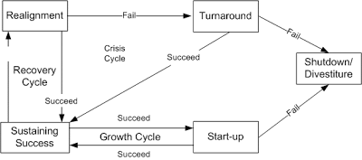
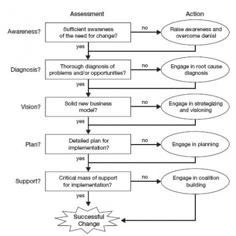

# The First 90 Days

These notes are from me reading Michael Watkin's [The First 90 Days](https://www.amazon.com/Watkins-Michae-First-Updated-Expanded/dp/B07ZQGM5WY/ref=sr_1_3?crid=3DJPLPQ5F4VXF&dchild=1&keywords=the+first+90+days&qid=1620224297&sprefix=the+first+90%2Caps%2C262&sr=8-3) during the spring of 2021 as I prepared to join Twilio. 

# Overview
The general premise of the book is that leaders set themselves up for success or failure within the first 90 days in a new role. Those that fail can often point back to missteps in those first 90 days that create established patterns of working that are hard to break out of. The book proposes that the purpose of the first 90 days is to establish a pattern of working that will setup success and accelerate your transition into a leader at a new level.

# Outline
The book focused on a 10-set roadmap that is high level enough to be broadly applicable to any leadership role if you squint. 

1. Promote Yourself
Realize that what made you successful in your old job will likely become an achillies heel in your new role. You have to stop doing the old job and focus on the new job.

2. Accelerate Learning 
You know less than the people you are about to lead. Accept that and adopt a learners mindset to understand what is really going on in your new organization before you attempt to make changes. Be deliberate about learning in order to accelerate this process - have a plan for how to get smart faster.

3. Match Strategy to Situation 
You have to really undertand the specifics of the situation you are in before you can setup a strategy to improve. Do not attempt to apply generic strategies or 'know' the answer too soon - understand your new org's specific problems.

4. Secure Early Wins
Try to make some small tweaks early so that you can build on success. Starting out with too large of changes usually leads to a difficult long road and often failure.

5. Negotiate Success 
You need to get buy in for your plans - invest time in making sure your boss in on board with what you intend to do and why you are doing it. Seek proactive feedback. 

6. Acieve Alignment
Everyone needs to come along for the ride - not just your boss but your peers and your team as well. Invest time in bringing people along slowly to ensure you will be supported.

7. Build Your Team
Take critical stock of your team's strengths and weaknesses. Be prepared to make changes to the team to minimize the weaknesses or accentuate the strengths depending on the needs of the situation. Take the time and care to decide where to invest and where to decrease investment. 

8. Create Coalitions
Reach outside your peer group and understand the needs of the greater business. Build relationships with those groups who are impacted by your organization or who partner with you.

9. Keep Your Balance
Always be self-critical and seek mentors/advisors that you can use as sounding boards to pressure-test your findings and your conclusions. Value the feedback you receive as perspective is important to keep your thoughts balanced.

10. Expedite Everyone
All of your leaders at all levels below you will need to go through the same process, to lesser degrees, that you are. If you invest in helping them follow the same process you are, they become change agents in the organization that help you accomplish your goals autonomously - invest in your people.

# Chapters
## Promote Yourself 
### Promote Yourself - Checklist
1. What has made you successful so far? Can you succeed just by relying on those strengths? What critical skills do you need to develop for your new role?
2. Are there aspects of your new job that are critical for success but you would prefer not focus on? Why is that? How do you intend to compensate for your personal blind spots?
3. What do you need to do to make sure you make the mental leap to your new position? Who will you seek advice from? 

## Accelerate Learning
### Accelerate Learning - Establish a Learning Agenda
Before you can start structured learning, you need to first establish an agenda of what you want to learn about - only then can you design a plan to learn. Without an agenda, you risk huge delays as you wander the halls of knowledge in no specific order learning about things that are of different levels of importance. By creating a learning agenda, you can prioritize what you learn about. 

Some good questions to help you create your learning agenda: 

Perfomance
- How has the org performed in the past? Do members of the org share this view?
- How were goals set in the past? Were they too big or too small of goals?
- Were there internal or external benchmarks for their goals?
- What were the measures? What behaviors did they encourage/discorage?
- What happend if goals were not met?

Root Causes
- If performance has been good - why? What is the secret sauce that worked?
- What part of success has come from
  - strategy?
  - structure?
  - technical capabilities?
  - culture?
  - politics?
- If performance has been poor - why? Where do the primary issues come from?

History of Change
- what efforts have been made to change the org already? What happened?
- Who are the thought leaders (past & present) that have influenced this org successfully?

Vision & Strategy
- What is the stated vision/strategy of the org? 
- Are we really pursuing what we say we are? Why/why not?
- Is this the right strategy for the business?

People
- Who are the bright spots? Who is struggling?
- Who can be trusted to operate autonomously and who needs more guidance?
- Who has influence and why?

Processes
- What are the key process elements?
- Are those processes actually achieving what they set out to? 
  - Quality?
  - Reliability?
  - Timeliness?
- Why or why not?

Land Mines
- What surprises might be lurking beneath the surface? 
- What are some damaging cultural or political things you need to avoid?

Early Wins
- In what areas can you get some early traction?

Challenges & Opportuntities
- This coming year, where will the business face the biggest challenges?
- What can you do now to prepare for these challenges?
- What are the most promising untapped opportunities?
- What needs to be done to harness that potential?

Barriers & Resources
- What needs to change most in the org to get to the next level?
- Are there islands of excellence where you can replicate those in the org?
- What does the org lack that can be acquired externally?

Culture
- What are the key elements of the culture that needs to be preserved?
- What elements need to change?

### Accelerate Learning - Questioning Template
To get a 360 view, try to make sure as you engage with people that you ask a fairly consistent set of questions to try to understand which views are held in which pockets of the company, and which are universal. For example:
1. What are the biggest challenges we will face in the near future?
2. Why are we facing these challenges?
3. What are the things you think we are under focused on today that we should pay attention to in order to accelerate our growth?
4. What would need to happen for us to be able to do that?
5. If you were me, what would you focus on first?

### Accelerate Learning - Creating the Learning Plan
Once you understand what you want to learn about, creating a structured plan to decide HOW you will learn the answers to your questions is the key to accelerating your learning. There are different techniques that you can apply to different situations. 

For instance:
- Employee Surveys - if employed regularly, good for discovering general sentiments and feelings
- Targeted Interviews - if targeted individuals are chosen right, this can be a great method for gaining broad understanding of a topic from different points of view 
- Focus Groups - great way to get employees working together to articulate both their problems and potential solutions. Becomes less effective as the diversity in the group point of view increases so not a great tool for cross-functional teams
- Analysis of Critical Past Descisions - (ie post mortem or retrospective) best used to derive trends when analyzing patterns - but risks going to deep on specifics and losing its value to the organization
- Process Analysis - useful when tracked over time to see productivity impacts of process decisions
- Pilot Projects - used to validate paths before too much resource is invested

### Accelerate Learning - Learning Plan Template
Before Starting
- Read anything you can about the org's strategy, structure, people and performance
- Look for external assessments of the org's performance (ie how do customers/partners feel about the performance)
- Interview former members of the team and partners to gain insights
- Interview your new boss
- Write down your impressions as you go, and formulate hypothesis with care
- Compile an initial set of questions to help guide your learning when you arrive

Immediately After Starting
- Review detailed key initiatives, plans, and performance reports
- Interview all directs 1x1, asking the same questions and learn convergent/divergent views on topics
- Understand the internal view of the external interfaces with your org early to gain key insights
- Work top down asking about strategy and vision - see where the messages change and break down
- Work from the bottom up asking about key challenges and opportunties to identify where the messages change and break down
- Update your written questions and hypothesis as you learn
- Meet with your boss and share your results and get feedback

By the end of the First Month
- Share your understandings of challenges and hypothesis with your directs and sollicit feedback and discussion with them as a group so that you can learn more about the group dynamics and their feelings on the accuracy of your findings
- Meet with key partners to understand how they view the org interfaces to get a more 360 picture 
- Pick a couple of key processes and analyze their effectiveness and costs with the groups who are responsible for those processes to learn about their views on productivity, quality and reliability
- Seek out natural historians (ie long haulers) who carry the past 'why' knowledge and mine them for information
- Update your questions & hypothesis
- Meet with your boss and share your results and get feedback

### Accelerate Learning - Checklist
1. Are you effective about learning the new org? Can you resist acting too soon before you have sufficiently understood? How can you avoid 'knowing the answer'? 
2. Have you set your learning agenda before going far? Have you created any hypothesis? If so, how will you test them?
3. Who can you rely on to give you solid insights that can become actionable early?
4. How can you extract more information with less time/effort?

## Matching Strategy to Situation
Employ the STaRS Model -- StartUp is the initial state for all things. Shutdown is the negative end-state in the state machine. Projects bounce between the other states as the buiness relatities change around them.

Often times individuals are good at managing in 1-2 of these states, but tend to be optimized for relatively few states, and struggle when they find themselves leading a business in a different state. 

Knowing which state your business is in is critical to building your strategy. Applying a strategy to the wrong state can spell disaster for your business. 

### Matching Strategy - Inherint Challenges & Opportunities
There are some generic patterns that can be applied ater you understand which state your org occupies in the STaRS Model

- Startup Mode
   - Challenges
     - Building Structures & systems from scratch w/out a clear framework or boundaries
     - Welding together a cohesive high-performing team
     - Making do with very limited resources
   - Opportunties 
     - Get started the 'right' way
     - Energizing atmosphere
     - No preexisting demons or rigidity of thought

- Turnaround Mode
  - Challenges
    - Reenergizing a demoralized team
    - Handling time pressure to get quick and decisive actions
    - Going deep enouhg with painful cuts and difficult personnel choices
  - Opportunties   
    - Does everyone even recognize that change is needed?
    - Change agents have been waiting for someone to take charge and are eager to help be part of the solution
    - Small successes yeild big results

- Realignment
  - Challenges
    - Dealing with cultural norms that are out of date or unproductive
    - Convincing people that change is needed
    - Restructuring usually required at the top to create the new focus
  - Opportunties   
    - Signigicant pockets of strength already exist 
    - Success has already been achieved, people want to continue that

- Sustaining Success
  - Challenges
    - Avoiding bad decisions in your inexperience 
    - Living in the shadow of past successful leaders
    - Finding novel ways to get to the next level
  - Opportunties
    - Strong team typically already in place
    - Motivation is usually high as team is being successful
    - Most elements will likely be working already

### Matching Strategy to Situation - Early Wins
Depending on your business state, early wins may vary greatly
- Startup wins might be all about putting the right team in place and achieveing organizational alignment on vision
- Turnound wins might look like puzzling out the dependable core of the business to keep, then pairing back everything the team is doing that isn't those things, and perhaps making some key team changes for the new focus
- Realignment wins will center around getting everyone to understand the problems the business is facing and instilling a sense of urgency to change
- Sustaining Success wins become all about your ability to demonstrate to the team that you have understood the key elements that have led to their success and that you value them

### Matching Strategy to Situation - Checklist
1. Which state are you in?
2. What are the implications for the challenges and opportunties you are likely to contront and for how you should approach the transition?
3. What are the implications for your learning agenda?
4. Which of your skills and strengths are most valuable? Which weaknesses might get you into trouble?
5. Should you focus on offensive expansion of what your team does, or play defense and practice honing your fundamentals for success?

## Early Wins
### Early Wins - Common Traps
- Not creating narrow enough focus
- Not accounting for the buiness situation when attempting actions
- Not adjusting your plan to account for the team culture that exists
- Failing to take actions that matter to your boss / help your boss understand why he should care about your actions
- Achieving your results but not demonstrating the behavior and culture you want to achieve in the organization (ie failure to live up to your own culture expectations)

### Early Wins - Create Your Priority List
To ensure your early wins are meaningful you need to make sure that every action you attempt aligns both to the long term culture you want to achieve, and to something that maps to the top of your priority list. If you compromise on culture, you demonstrate to the team that you aren't serious about culture. If you compromise on priority, your actions will fail to have sufficient impact to effect meaningful change or build momentum.

- Priorities should follow naturally from the core problems of the business
- Prioerities cannot be too general (vague) or too specific (sand)
- Priorities should offer a clear direction, but allow flexibility in execution while you are still in learning mode

### Early Wins - Securing the Win
Make 2 buckets for your priorities - those that can be materially advanced or achieved in 30 days, and those that will be achieved within the 90 days. 

Watch out for problemative behavior pattenrs:

- Lack of Focus
  - group has no clear priorities and struggles to define them or has too many priorities to hope to achieve
  - Resources spread too thin leading to frequent crises, firefighting and total reprioritization

- Lack of Discipline
  - huge variation in performance levels across the team
  - employees do not understand negative consequences of inconsistencies
  - excuse culture when we fail to reach commitments

- Lack of Innovation
  - internal benchmarks are used to measure performance
  - improvments to products/processes evolve very slowly and incrementally only

- Lack of Teamwork
  - teammates compete for turf and accolades
  - people get rewarded for fifedoms

- Lack of Urgency
  - team members slow to respond to internal and external customer needs
  - complacent culture 

 ### Early Wins - Building Credibility
Credible leaders are:
- Demanding, but able to be satisfied
- Accessible, but not too familiar
- Decisive, but open and listening
- Focused, but flexible to change when new information arrives
- Active, but not disruptive
- Makes tough calls, but displays compassion

### Early Wins - Tangible Results
- Start from a list of long term goals
- Identify a few promising areas before deciding
- Concrentrate on a 3-4 of the most promising places only 
- Pilot projects and see success before bringing them broad
- Identify and elevate change agents 
- Leverage pilot successes to advertize new desirable behaviors

### Early Wins - Pilot Project Checklist
- What is the right mix of people (skills/knowledge/teamwork) to be successful at this project?
- Who has the credibility, management skills and creativity to lead this project?
- What are achievable stretch goals?
- What are achievable deadlines?
- What coaching or framework will help guide problem solving and decision making?
- What are resources are needed?
- Who will you hold people accountable for achieving superior results?
- How will you reward success?

### Early Wins - Leading Change

### Early Wins - Checklist
1. What should be the timing and extent of each change given your situation?
2. What is your top priority list? What do you need to do during your transition to lay the groundwork for this?
3. What cultural changes to you want to enact? Include both encouraged and discouraged elements
4. What can you do to begin projecting and encouraging the new culture you want during your transition?
5. How do you plan to connect yourself to your org? Who are your key audiences and what messages do you want to convey to them? What is the best ways to connect with them?
6. What are the most promising focal points for your first phase of transition? 
7. What areas do you need to do more experimentation in to leverage collective learning?

## Negotiating Success
Establishing a working relationship and shared set of expectations with your boss is critical to your success - do not underestimate the value of your boss's support

- Do not trash the past - hindsight is always 20/20 and assume best intent - folks did the best thing they could in the situation they were in at the time.
- Proactively connect with your boss, even if he doesn't seem to have time for you
- Do not surprise your boss
- Come to your boss with solutions, not just problems
- Do not just run down your checklist in 1x1s - focus on discussing the issues that your boss can help with or that you want to highlight only
- Do not try to change your boss - adapt your style to meet his
- Clarify mutual expectations early & often
- Negotiate timelines for diagnosis, not just for action
- Focus early wins in areas that your boss values to build credibility
- Understand whose opinions matter to your boss and make sure you make an effort to develop positive relationships with his key influencers

### Negotiating Success - 5 Key Conversations
1. Diagnosing Business Situation - hear from your boss how they see the business and the challenges and opportunties it faces
2. Expectation Setting - understand not just deliverables but nuances the boss thinks are important
3. Style Accomodations - establishing norms of your working relationship in explicit terms
4. Resourcing - what do you need to really accomplish the expectations
5. Personal Development - proactively ask for specific feedback areas for your career development and calibration

### Negotiating Succes - Boss's Role in Situations
Startup:
- Help getting resources quickly
- Clear measurable goals
- Guidance at strategic forks in the road
- Help staying focued

Turnaround - same as startup, plus:
- support making/implementing hard personnel decisions
- support checking/correcting external image of org
- help taking decisive action early enough and deep enough

Realignment - same as turnaround, plus:
- help making a case in the org for the changes needed

Sustaining Success:
- constant reality testing: are we still successful or are we slipping into Realignment?
- support for playing good defense and avoiding mistakes that can damage the business
- help finding new paths to take the business to a new level

### Negotiating Success - Checklist
1. How effectively have you built relationships with new bosses in the past? What have you done well? What areas do you need to improve?
2. Create a plan for the situational diagnosis conversation. What will you raise? What do you want to say up front? What order will you tackle the issues?
3. Create a plan for the expectations conversation. How will you figure out the expectations on you?
4. Create a plan for the style conversation. How much detail should you provide? Where do you have full agency and where does he expect to consultation?
5. Create a plan for the resources conversation. What is your minimimum viable? What would you trade to get them?
6. Create a plan for the personal development conversation. What are your strengths and weaknesses? What kinds of opportunties do you want to focus on to help yourself develop?

## Achieve Alignment
### Achieve Alignment - Identifying Misalignment
- Skills <<->> Strategy gap - ie people are unable to achieve strategy
- Systems <<->> Strategy gap - ie systems do not in place to support strategy
- Structure <<->> Strategy gap - ie wrong organizational incentives/responsibilities to achieve the strategy
  
### Achieve Alignment - Avoiding Common Traps
- Restructuring as a magic bullet to solve all problems
- Overly complex/matrixed structures
- Automating bad processes instead of replacing them
- Change without clear purpose
- Changing too much at once

### Archieve Alignment - Getting Started
- Set Strategy before changing anything
- Carefully consider existing systems, skills and structure before making any decisions
- Decide how/when to roll out the new strategy
- Reshape structure, systems and skills all at the same time but after strategy is understood -- focusing on just one will usually not yeild sufficient results, starting before strategy is groked will often fail
- Listen to feedback and adjust 

### Achieve Alignment - Ongoing Assessment
- Skills/knowledge in team sufficient to their mission?
- Team decision making scope too narrow or too broad for their mission?
- Are team members incentivized for their mission properly?
- Are islands of comparmentalization or lack of clear accountability emerging?

### Achieve Alignment - Initiating Cultural Change
- Focus on performance measures and incentives to align to the right behaviors you want in the culture
- Setup pilot projects and nuture their successes and expand on them
- Bring in outside thinkers to help guide the future
- Promote collective learning - sharing of ideas and working together on new projects - lean towards concensus 
- Repeat the collective vision over and over

### Achieve Alignment - Checklist
1. What misalignments have you detected? How will you dig deeper to confirm or disprove your observations?
2. What decisions do you need to make, and which can be delegated? When will these decisions be made?
3. How solid is the org strategy? What changes do you think need to be made?
4. What are the strengths and weaknesses of the current structure? What changes are you thinking about making?
5. What are the core processes and how well are they working? What are your priorities for improvement?
6. What skills gaps or underutilized resources do you have? What are you priorities for addressing these?
7. What are the functional and non-functional elements of the culture? What do you think you want to change about the culture? How will you start?

## Building Your Team
### Building Your Team - Missteps
- Keeping the same people in the same positions for too long
- Not fixing the problems that are surfacing
- Not working alignment & structure issues at the same time
- Not retaining valued team members
- Too much team building before establishing the core team
- Implementation-specific decisions made too early
- Trying to do it all yourself

### Building Your Team - Establishing Criteria
Judge each team member on the following axis:
- Competence
- Judgement
- Energy
- Focus
- Relationships
- Trust

### Building Your Team - Assessing your team
- Prepare for each meeting in advance - do not walk in cold
- Ask probing questions associated with your learning agenda. Ask their opinions not just facts. Use the same set of core questions for everyone to get a more 360 view.
- Watch for non-verbal queues as well as the content. Read behind the content of the situations and look for themes of behavior across the questions. 

### Building Your Team - Push & Pull Motivations
Push Motivations
- Monitary incentives
- Social incentives
- Management feedback

Pull Motivations
- Shared vision 
- Teamwork
- Culture

### Building Your Team - Decision Making
Spectrum of decision making:
Unilateral Pronouncement --> Consult-and-Decide --> Concensus --> Unanimous

- Stay away from the extremes. 
- Use Concensus when you need to build participation and ownership in a decision. 
- Use Consult-and-Decide NOT because of time pressure but when either there needs to be a clear individual accountability for the decision or when the leader needs to establish a clear path that would not be arrived at via concensus. 
- DO NOT start on one path and then switch because you are frustrated that something is taking too long - it destroys trust
- Up front ensure everyone knows how a decision will be made

### Building Your Team - Checklist
1. What criteria are you using to assess team performance? 
2. What personnel changes do you think you need to make?
3. What process will you put in place to alter your org?
4. WHere will you get the help you need to restructure?
5. Do you need to change any incentives or measures?
6. How do you want your new team to operate?
7. How do you plan to manage decision making?

## Creating Coalitions
Start from building an influence map on paper - chart the lines of influence between the key players and understand the strength of those relationships (thicker lines)

Key aspects of influence include:
- Expertise 
- Access to information
- Status
- Personal Loyalty
- Control of resources (people, budgets, incentives)

### Creating Coalitions - Appealing to Core Values
Try to understand the motivations and core values of your peers. By frameing your requests for help or offers for help in terms that speak to their motivations and values, you increase the chances of successful colaboration, and strengthen your own lines of influence

Loyalty
- Commitment to an ideal
- Sacrafice to realize that idal

Commitement & Contribution
- Service to customers/partners
- Creating a better organization, society, or world

Individual worth & Dignity
- Respect, equality, decency for all
- helping individuals realize their own potential

Integrity 
- Respect for the letter as well as the spirit of the law
- ethical and honest behavior
- Faireness in interactions

### Create Coalation - Checklist
1. Whose support do you most need to succeed? What are the existing coalitions that you might be able to gain influence with?
2. What netwrosk are most important to you? Who are the key influencers in those networks?
3. Who are your potential supports and who should you think about supporting? Who are folks you will have as early oppontents that you want to begin to build a relationship with?

## Keep Your Balance
Watch that the job doesn't overwhelm you. Keep your life balanced and not just let the job absorb you. 

### Keep Your Balance - Avoid Vicious Cycles
- Too many directions at once
- No boundary definitions
- Rigidity in your thinking or actions
- Isolation 
- Personal Biases
- Avoiding certain areas
- Too much stress

### Keep Your Balance - 3 Key Pillars
1. Adopt strategies to lead to success but reassess and change your strategy as new information arrives
2. Enforce personal disciplines - do not veer outside what you define as YOUR job vs someone elses
3. Build your support system - no one is an island

### Keep Your Balance - self assessment
- Are you adopting the right minset for the new job and letting go of the past?
- Are you figuring out what you need to learn, from whom, and how to speed up that learning?
- Are you diagnosing the type of transition you are facing and the implcations for what to do and what not to do?
- Are you focusing on vital priorities that advance the long term goals and build short term momentum?
- Are you building your relationship with your new boss, managing expectations and marshalling the resources you need?
- Are you identifying and fixing frustrating misalignments of strategy, structure, systems and skills?
- Are you assessing, restructuring, and aligning your team to leverage what you are trying to accomplish?
- Are you building a base of internal and external support for your initiatives so you are not pushing rocks uphill?

### Keep Your Balancing - Avoiding Burn Out
- Plan for time to plan things
- Defer commitment until necessary - never say yes without long up front thought
- Set aside time for hard work - block off your calendar
- Take a step back and resasses situations regularly from a long term view
- Focus on processes, not tasks
- Check in with yourself - ask critical questions of yourself and really think about the answers

### Keep Your Balance - Structured Reflection
What do you feel so far?
- Excited? if not, why not? What can you do about it?
- Confident? if not, why not? What can you do about it?
- Are you in control of your own success? Why not? What can you do about it?

What is bothering you?
- who have you failed to connect with? Why?
- what was the most troubling thing you've seen? Why?
  
What has gone well/poorly?
- which interactions do you want a do-over for? Why?
- which decisions are proving positive?
- what missed opportuntity do you regret the most?

### Keep Your Balance - Checklist
1. What are your greatest vulnerabilities? How do you plan to compensate for them?
2. What personal disciplines do you most need to develop/enhance? How will you do that?
3. What can you do to gain more control over your local environment?
4. What can you do to make the transition easier on your family?
5. What are your priorities for building your council of advisors?

## Expedite Everyone
Generally apply the concepts you are using in coaching your directs to do the same - help them ease their transitions.

### Expedite Eveyrone - Checklist
1. Whose transition is most vital to your success? What are you doing to help them accelerate?
2. Should you think about a more structured 'new leader' trianing process?
3. What can you do to better support an onboarding from the outside?
4. Are there other places this model can apply in your organization?

  